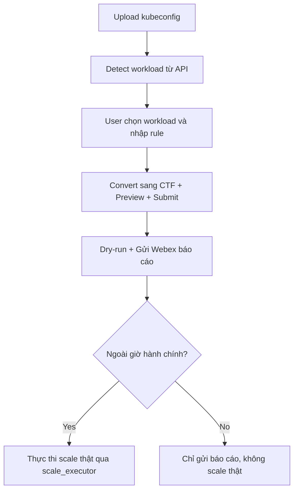

# 📄 URD: Tự động Scale Workload K8s Ngoài Giờ Hành Chính

## 1. 🎯 Mục tiêu & Use Case
- Tự động scale các workload Kubernetes ngoài giờ hành chính để giảm chi phí tài nguyên.
- Một số workload sẽ được khai báo ngoại lệ theo thời gian hoạt động linh hoạt hơn.
- Workload mặc định gồm 2 loại: `deployment`, `statefulset`.
- Quy trình sẽ được thực thi đầu và cuối giờ làm việc qua tool định kỳ hoặc Web UI trigger tay.
- Các workload không có rule khai báo sẽ mặc định:
  - Scale về 0 ngoài giờ.
  - Trong giờ hành chính scale mặc định về 1 replica, hoặc replica được khai báo qua Helm values.

## 2. 👤 Quy trình sử dụng thực tế

### 2.1 PM/Dev sử dụng UI như sau:
- PM upload kubeconfig (được cấp quyền `view` đủ các namespace cần).
- Tự động truy namespace, workload từ API K8s.
- Chọn workload, nhập thời gian hoạt động (days, hours), expire, replica.
- Mỗi rule sẽ ghi rõ `requester` (PM) và `submitter` (người gửi rule).
- Có thể lọc theo namespace hoặc tên workload.

### 2.2 Reuse báo cáo dry-run
- Sau khi nhập rule → preview dry-run → có thể **export CTF** để lưu hoặc reuse sau.
- Cho phép upload lại file dry-run `.ctf` để sửa và gửi lại.

## 3. 🔐 Quản lý credential & bảo vệ namespace

### 3.1 Credential
- PM sẽ được cấp một file kubeconfig duy nhất, có quyền view toàn bộ namespace cần thiết.
- Khi cần dev owner khai báo giúp:
  - PM gửi lại chính kubeconfig đó cho dev.
  - Dev thực hiện nhập rule giúp, vẫn giữ nguyên requester là PM.

### 3.2 Protected Namespace
- Các namespace hệ thống cần được bảo vệ không bị scale về 0.
- Các workload thuộc namespace này sẽ được bỏ qua khi xử lý dry-run/apply.
- Danh sách namespace này khai báo trong config:
```yaml
protectedNamespaces:
  - kube-system
  - monitoring
  - cattle-system
```

## 4. 🧾 Định dạng khai báo CTF (Compact Table Format)

```text
# requester | namespace | workload | replica | days     | hours   | expire     | purpose
pm1        | team1     | svc-a    | 3       | Mon-Sat  | 00h-24h | 21/08/2025 | test ebank
```

| Trường     | Bắt buộc | Mô tả |
|------------|----------|------|
| requester  | ✅       | Người tạo request (PM) |
| namespace  | ✅       | Namespace workload (auto detect) |
| workload   | ✅       | Tên workload (auto detect) |
| replica    | ✅       | Số lượng pod mong muốn |
| days       | ✅       | VD: Mon-Fri, Sat-Sun |
| hours      | ✅       | VD: 08h-18h |
| expire     | ✅       | DD/MM/YYYY |
| purpose    | ✅       | Ghi rõ mục đích sử dụng |

## 5. 🔧 Công nghệ & công cụ
- Ngôn ngữ: Python (FastAPI cho backend), React + Tailwind (frontend).
- Triển khai bằng Helm Chart trên Kubernetes.
- Hỗ trợ trigger định kỳ bằng: K8s CronJob, Jenkins, AWX, Ansible.

## 6. 🔄 Flow hệ thống



## 7. 🧠 Logic xử lý backend

### 7.1 Ưu tiên rule
- Rule nào `expire` xa hơn ưu tiên
- Cùng expire → ưu tiên `replica` lớn hơn
- Cùng replica → ưu tiên thời gian hoạt động dài hơn (ngày + giờ)

### 7.2 Xử lý trùng rule
- Merge rule conflict: chỉ giữ rule hiệu lực cao nhất
- Log lại nếu có conflict (ghi rõ ai gửi, giữ rule nào)

### 7.3 Fallback mặc định
- Nếu workload không có rule:
  - Trong giờ hành chính: scale về default (1 hoặc theo values.yaml)
  - Ngoài giờ hành chính: scale về 0

## 8. ✉️ Notify & Dry-run Report
- Gửi Webex report markdown đẹp (dùng ký tự • tránh lỗi format)
- In ra console
- Có thể export `.ctf` từ dry-run để tái sử dụng

## 9. 🧪 Test & Logging
- `--dry-run`: không scale thật
- `--verbose`: log chi tiết
- Log theo stdout (CronJob, Jenkins...)

## 10. 🕒 Giờ hành chính
- 08:00–18:00, Thứ 2–Thứ 6
- Ngoài giờ hành chính = scale về 0 nếu không có rule override

## 11. 🚀 Triển khai hệ thống (Helm)

```bash
helm repo add autoscale https://your-repo/autoscale
helm install autoscale-system autoscale/autoscale-system -f values.yaml
```

## 12. 📂 Cấu trúc Project

```
k8s-autoscaler/
├── autoscaler/
│   ├── ctf_parser.py
│   ├── kubeconfig_parser.py
│   ├── dry_run_engine.py
│   ├── notifier.py
│   ├── scale_executor.py
│   ├── config.py
├── api/
├── cronjob/
├── tests/
├── conf/
│   ├── example.ctf
│   └── .env.example
```

## 13. 🧭 Trình tự phát triển hệ thống

### Giai đoạn 1: Core backend (standalone)
1. `ctf_parser.py`: parse file CTF, validate
2. `kubeconfig_parser.py`: truy namespace & workload từ kubeconfig
3. `dry_run_engine.py`: tính bật/tắt workload, fallback giờ hành chính
4. `notifier.py`: gửi Webex
5. `scale_executor.py`: scale workload thật

### Giai đoạn 2: API backend (FastAPI)
6. `main.py`, `workload.py`, `rule.py`, `admin.py`: UI giao tiếp với backend

### Giai đoạn 3: Frontend UI
7. Upload kubeconfig, chọn workload, gửi rule
8. Admin xem dry-run → duyệt

### Giai đoạn 4: Triển khai & kiểm thử
9. Cronjob gọi backend
10. Helm chart deploy hệ thống

## 14. ✅ Progress Log

| Ngày | Module | Trạng thái |
|------|--------|------------|
| 2024-04-11 | Khởi tạo project | ✅ |
| 2024-04-11 | `ctf_parser.py` | ✅ |
| 2024-04-11 | `kubeconfig_parser.py` | ✅ |
| 2024-04-12 | `dry_run_engine.py` | ✅ |
| 2024-04-12 | `notifier.py` | ✅ |
| 2024-04-13 | `scale_executor.py` | ⏳ |
| 2025-04-12 15:37 | `scale_executor.py` | ✅ Hoàn thành + test dry-run | Đã xử lý PROTECTED_NAMESPACES, log rõ ràng |

## 15. 🎯 Feature & Scenario (Gherkin Format)

```gherkin
Feature: Scale workload Kubernetes ngoài giờ hành chính

  Scenario: PM upload kubeconfig và tạo rule
    Given PM có file kubeconfig với quyền view workload
    When PM upload file và chọn workload cần tạo rule
    Then Rule được lưu và preview dry-run được gửi qua Webex

  Scenario: Ngoài giờ hành chính, hệ thống tự động scale
    Given Rule hợp lệ và đang ngoài giờ hành chính
    When Cronjob trigger dry-run
    Then scale_executor thực thi scale theo rule

  Scenario: Trong giờ hành chính, không scale thật
    Given Rule hợp lệ và trong giờ hành chính
    When Cronjob trigger dry-run
    Then chỉ gửi báo cáo Webex, không thực thi scale

  Scenario: Namespace hệ thống được bảo vệ
    Given Workload thuộc namespace nằm trong `protectedNamespaces`
    When Rule không tồn tại hoặc hết hạn
    Then workload vẫn giữ nguyên, không scale về 0
```