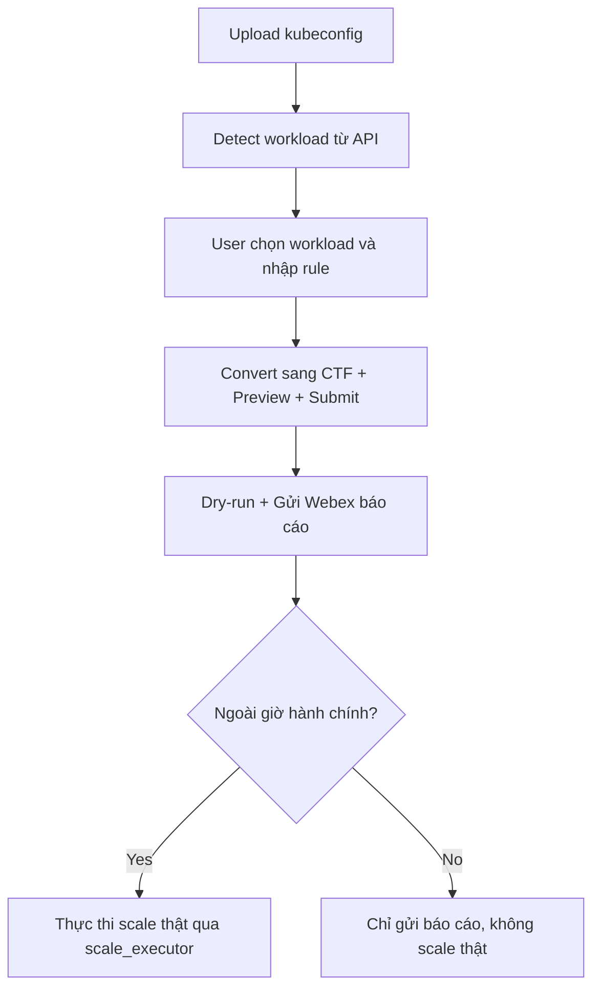

# 📄 URD: Tự động Scale Workload K8s Ngoài Giờ Hành Chính

## 1. 🎯 Mục tiêu & Use Case
- Tự động scale các workload Kubernetes ngoài giờ hành chính để giảm chi phí tài nguyên.
- Một số workload được khai báo ngoại lệ (exception) có thời gian hoạt động linh hoạt hơn.
- Workload mặc định gồm 2 loại: `deployment`, `statefulset`.
- Quy trình được thực thi đầu và cuối giờ làm việc qua tool định kỳ hoặc Web UI trigger tay.
- Các workload không có rule khai báo sẽ mặc định:
  - Scale về 0 ngoài giờ.
  - Trong giờ hành chính scale mặc định về 1 replica, hoặc replica được khai báo qua Helm values.

## 2. 👤 Quy trình sử dụng & Phân quyền thực tế

### 2.1 PM tạo rule:
- PM được cấp kubeconfig có quyền **view toàn bộ namespace** trong cluster.
- UI hỗ trợ:
  - Upload kubeconfig → detect workload theo namespace có quyền.
  - Lọc nhanh theo namespace hoặc tên workload.
  - Nhập rule (days, hours, expire, replica, purpose).

### 2.2 Khi cần dev hỗ trợ khai báo:
- PM gửi lại file kubeconfig duy nhất cho dev owner.
- Dev dùng UI hỗ trợ khai báo hộ → vẫn ghi rõ requester là PM, submitter là dev.

### 2.3 Xử lý namespace đặc biệt:
- Có thể cấu hình danh sách `protectedNamespaces` (ví dụ: `kube-system`, `istio-system`,...)
- Các workload thuộc namespace này sẽ **bị bỏ qua**, không scale, không báo lỗi, không ghi vào dry-run report.

## 3. 🧾 Định dạng CTF (Compact Table Format)

```text
# requester | namespace | workload | replica | days     | hours   | expire     | purpose
pm1        | team1     | svc-a    | 2       | Mon-Sat  | 08h-22h | 15/08/2025 | test service A
```

## 4. ⚙️ Web UI – Tạo & duyệt rule

### 4.1 Giao diện người dùng
- Upload kubeconfig → tự detect workload.
- Lọc theo namespace, workload.
- Nhập rule → Preview → Submit → gửi báo cáo dry-run.

### 4.2 Giao diện admin
- Xem báo cáo dry-run tổng hợp trong ngày.
- Theo mặc định:
  - Nếu rule hợp lệ và nằm ngoài giờ hành chính → **tự động thực thi luôn** (auto-apply).
  - Trong giờ hành chính: gửi báo cáo để admin nắm được tình hình, **không scale thật** vì workload đã bật sẵn.

## 5. 🔄 Flow hệ thống



## 6. 🧠 Logic xử lý backend

- Nếu workload có rule:
  - Ưu tiên rule theo: `expire xa hơn` → `replica lớn hơn` → `thời gian dài hơn`.
- Nếu không có rule:
  - Trong giờ hành chính → scale về mặc định (1 hoặc theo values.yaml).
  - Ngoài giờ hành chính → scale về 0.
- Các workload trong `protectedNamespaces`:
  - Bỏ qua hoàn toàn (không scale, không log, không gửi Webex).
- Chống race condition bằng lock file `/tmp/k8s-autoscale.lock`.

## 7. ✉️ Notify & Dry-run Report

- Dry-run hiển thị:
  - ✅ KEEP: các workload sẽ được giữ (theo rule).
  - 🛑 SCALE TO 0: các workload không match rule.
  - ❗ SKIPPED: các workload trong `protectedNamespaces`.

- Báo cáo gửi Webex (qua `notifier.py`) thay vì email.

## 8. 🧪 Dry-run & Logging

- `--dry-run`: mô phỏng xử lý, không tác động.
- `--verbose`: ghi log chi tiết.
- Cho phép export kết quả dry-run dưới dạng `.ctf` để reuse.

## 9. 🛡️ Namespace bảo vệ (protected)

```yaml
protectedNamespaces:
  - kube-system
  - istio-system
  - cattle-system
```

## 10. 🗄️ Config default

```yaml
defaultReplicas:
  team1/svc-x: 2
  team2/svc-y: 3
```

## 11. 🚀 Helm Deploy

```bash
helm repo add autoscale https://your-repo/autoscale
helm install autoscale-system autoscale/autoscale-system -f values.yaml
```

## 12. 📂 Cấu trúc Project

```
k8s-autoscaler/
├── autoscaler/
│   ├── ctf_parser.py
│   ├── kubeconfig_parser.py
│   ├── dry_run_engine.py
│   ├── notifier.py
│   ├── scale_executor.py
│   └── config.py
├── tests/
│   └── test_dry_run_engine.py
├── conf/
│   ├── example.ctf
│   └── .env.example
├── helm/
├── urd_autoscale.md
```

## 13. 🧭 Trình tự phát triển hệ thống

### 🧱 Giai đoạn 1: Core backend
1. `ctf_parser.py`: parse file CTF
2. `kubeconfig_parser.py`: đọc kubeconfig
3. `dry_run_engine.py`: xử lý rule + fallback
4. `notifier.py`: gửi Webex báo cáo dry-run
5. `scale_executor.py`: thực hiện scale thật

### 🧱 Giai đoạn 2: API
6. `main.py`, `rule.py`, `workload.py`: nhận input, sinh dry-run

### 🧱 Giai đoạn 3: UI
7. Upload kubeconfig, chọn workload
8. Gửi rule
9. Xem dry-run, download lại .ctf nếu cần

### 🧱 Giai đoạn 4: Triển khai
10. Cronjob gọi backend
11. Helm deploy stack
12. Kiểm thử toàn hệ thống

## ✅ Progress Log

| Ngày        | Module              | Trạng thái                       |
|-------------|---------------------|----------------------------------|
| 2024-04-11 | khởi tạo project     | ✅ đã init                       |
| 2024-04-11 | `ctf_parser.py`      | ✅ parse file CTF                |
| 2024-04-11 | `kubeconfig_parser`  | ✅ detect workload qua API       |
| 2024-04-11 | `dry_run_engine.py`  | ✅ xử lý rule + báo cáo dry-run  |
| 2024-04-11 | `notifier.py`        | ✅ gửi Webex báo cáo             |