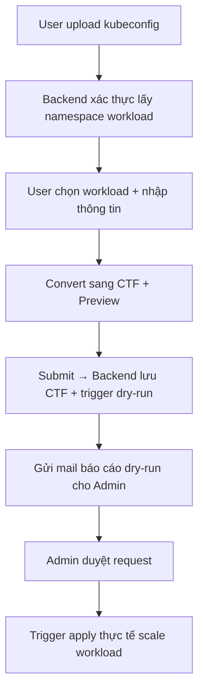

# 📄 URD: Tự động Scale Workload K8s Ngoài Giờ Hành Chính

## 1. 🎯 Mục tiêu & Use Case
- Tự động scale các workload Kubernetes ngoài giờ hành chính để giảm chi phí tài nguyên.
- Một số workload sẽ được khai báo ngoại lệ theo thời gian hoạt động linh hoạt hơn.
- Workload mặc định gồm 2 loại: `deployment`, `statefulset`.
- Quy trình sẽ được thực thi đầu và cuối giờ làm việc qua tool định kỳ hoặc Web UI trigger tay.
- Các workload không có rule khai báo sẽ mặc định:
  - Scale về 0 ngoài giờ.
  - Trong giờ hành chính scale mặc định về 1 replica, hoặc replica được khai báo qua Helm values.

## 2. 👤 Workflow & Credential thực tế

### 🧩 Quy trình tạo rule:
- Người tạo rule thường là **PM**, có quyền view đủ các namespace mình quản lý.
- PM sử dụng UI để:
  - Upload kubeconfig
  - Xem được toàn bộ workload mình có quyền
  - Chọn và nhập rule theo workload

### 🔁 Khi cần dev khai báo hộ:
- PM gửi lại **file kubeconfig duy nhất** cho dev owner (được cấp sẵn quyền view workload).
- Dev dùng UI để hỗ trợ khai báo hộ PM.
- Rule vẫn ghi rõ `requester` là PM và `submitter` là dev (log/audit).

### 🔎 UI hỗ trợ lọc namespace:
- Giao diện cho phép lọc theo **namespace, tên workload** giúp người dùng dễ thao tác và tìm kiếm.
## 2. 🔧 Công nghệ & công cụ
- Ngôn ngữ: `Python` (FastAPI cho backend), `React` + `Tailwind` (frontend).
- Triển khai bằng Helm Chart trên Kubernetes.
- Hỗ trợ trigger định kỳ bằng: `K8s CronJob`, `Jenkins`, `AWX`, `Ansible`.

## 3. 🧾 Định dạng khai báo CTF (Compact Table Format)

```text
# requester | namespace | workload | replica | days     | hours   | expire     | purpose
quyen.nt    | team1     | t1-A     | 2       | Mon-Sat  | 8h-22h  | 15/08/2025 | test service A
```

## 4. ⚙️ Web UI – Tạo & duyệt exception list
- Upload file kubeconfig để xác thực và truy xuất thông tin user.
- Tự động detect namespace và workload theo kubeconfig.
- Hiển thị danh sách workload → người dùng chọn, nhập rule.
- Trang admin duyệt → trigger apply thật.

## 5. 🔄 Flow xử lý hệ thống



## 6. 🧠 Logic xử lý backend
- Nếu workload nằm trong CTF → lấy rule.
- Nếu không có rule → scale theo mặc định (Helm config hoặc 1).
- Xử lý ưu tiên rule theo `expire` và thời gian dài hơn.
- Lock file: tránh 2 job chạy cùng lúc.

## 7. ✉️ Gửi mail & Audit Trail
- Gửi báo cáo khi dry-run và khi apply thật.
- Có thể lưu vết dưới dạng mail hoặc log file `.ctf`.

## 8. 🧪 Dry-run & Logging
- `--dry-run`: mô phỏng scale, không tác động thật.
- `--verbose`: log chi tiết.
- Ghi log theo stdout (cronjob, Jenkins...).

## 9. 📅 Cron Schedule gợi ý
- 07:00 sáng: scale theo rule hoặc default
- 18:30 tối: scale về 0 nếu không thuộc rule

## 10. 🗄️ Lưu trữ cấu hình
- Rule từ UI sẽ lưu vào file `.ctf` quản lý qua backend.
- Mặc định scale replica khác 1 → config trong `values.yaml`

```yaml
defaultReplicas:
  team1/t1-A: 2
  team1/t2-B: 3
```

## 11. 🚀 Deploy bằng Helm
```bash
helm repo add autoscale https://your-repo/autoscale
helm install autoscale-system autoscale/autoscale-system -f values.yaml
```

## 12. 📁 Cấu trúc project Backend

```
k8s-autoscaler/
├── autoscaler/        # Core logic
├── api/               # FastAPI backend
├── cronjob/           # Scheduled script
├── tests/             # Unit tests
├── conf/              # Cấu hình Helm, ví dụ .ctf
├── helm/              # Helm chart
├── urd_autoscale.md   # 📄 Tài liệu URD chính thức
```

## 13. 🧭 Trình tự phát triển hệ thống

### 🧱 Giai đoạn 1: Core backend (standalone)
1. `ctf_parser.py`: parse file CTF, validate
2. `kubeconfig_parser.py`: đọc kubeconfig, namespace
3. `dry_run_engine.py`: tính bật/tắt workload
4. `mail_notifier.py`: gửi mail dry-run và apply thật
5. `scale_executor.py`: scale workload thật qua API

### 🧱 Giai đoạn 2: API backend (FastAPI)
6. `main.py`, `workload.py`: upload kubeconfig → lấy workload
7. `rule.py`: nhận rule → lưu CTF → dry-run → gửi mail
8. `admin.py`: duyệt → apply thật

### 🧱 Giai đoạn 3: Frontend UI
9. Upload kubeconfig, chọn workload
10. Preview CTF, gửi rule
11. Admin duyệt từ UI

### 🧱 Giai đoạn 4: Triển khai & test
12. Cronjob gọi backend
13. Helm chart deploy stack
14. Test trên workload thật

## ✅ Quy ước cập nhật URD
- Mỗi module xong sẽ update log mục "Progress Log" bên dưới.
- Ghi rõ ngày, module, trạng thái test, ghi chú nếu có thay đổi.

## ✅ Progress Log
- [x] 2024-04-xx: khởi tạo project k8s-autoscaler
- [x] 2024-04-xx: `ctf_parser.py` – đã parse & validate rule CTF
- [x] 2024-04-xx: `kubeconfig_parser.py` – truy namespace & workload thật từ file kubeconfig
- [ ] 2024-04-xx: `dry_run_engine.py` – đang phát triển


---

## 📝 Tính năng mở rộng: Export báo cáo dry-run để tái sử dụng

### 🎯 Mục tiêu
- Cho phép người dùng (requester) **export báo cáo dry-run** dưới dạng file `.ctf` hoặc `.xlsx`
- Người dùng có thể:
  - Xem lại các rule mình đã tạo
  - Chỉnh sửa file bằng tay
  - Tải lên lại để sử dụng hoặc submit lại sau này

### ✅ Cách hoạt động
1. Sau khi người dùng tạo rule trên UI và bấm "Preview":
   - Backend sinh file dry-run `.ctf` (hoặc `.xlsx`) tương ứng
   - Cho phép **tải về** để chỉnh sửa hoặc lưu lại

2. Lần sau khi muốn reuse:
   - Người dùng chỉ cần **upload lại file** đã được chỉnh sửa
   - Backend sẽ validate lại như thường lệ và hiển thị preview mới

### 📦 Lợi ích
- Giảm thao tác nhập lại toàn bộ rule nhiều lần
- Dễ copy/paste giữa team
- Phù hợp cho người dùng muốn quản lý file offline hoặc backup kế hoạch


---

## 🧩 UI hỗ trợ lọc namespace và phân quyền theo workflow thực tế

### 🔍 Tính năng UI: Lọc workload theo namespace
- Khi user upload kubeconfig và hệ thống truy vấn được danh sách workload:
  - UI cần hỗ trợ **lọc theo namespace**, tên workload (fuzzy search)
  - Giúp PM dễ tìm và chọn đúng workload cần tạo rule
  - Giảm tải giao diện nếu user có quyền truy cập nhiều namespace (>50)

### 👤 Thực tế workflow sử dụng
- Người tạo request thường là **PM**, dùng credential chỉ có quyền `view` để query workload
- PM không phải lúc nào cũng biết workload cụ thể cần bật, nên sẽ:
  - Gửi kubeconfig và yêu cầu **dev team khai báo hộ**
  - Dev có thể sử dụng chính UI để khai báo giúp, dựa trên request từ PM

### 🔁 Tình huống:
- 1 PM có thể quản lý nhiều team, nhiều namespace khác nhau
- Có thể dùng nhiều kubeconfig tương ứng để tạo đủ rule mong muốn
- UI cần cho phép:
  - Tải lên lại kubeconfig khác
  - Gán `requester` rõ ràng trên mỗi rule
  - Lưu lại thông tin ai là người submit để audit


### 🛡️ Đính chính về việc sử dụng credential

- PM sẽ được cấp một **file kubeconfig duy nhất**, chứa quyền `view` đủ tất cả các namespace và workload cần thiết cho công việc của họ.
- Khi cần dev owner khai báo giúp:
  - PM sẽ **gửi lại chính file kubeconfig này** cho dev
  - Dev dùng UI để hỗ trợ khai báo hộ PM, không cần xin thêm quyền hay kubeconfig riêng
- Việc này đảm bảo:
  - **Kiểm soát tốt phạm vi quyền truy cập**
  - Không cần cấp nhiều credential khác nhau
  - Vẫn giữ được tính minh bạch: `requester` là PM, `submitter` là dev

