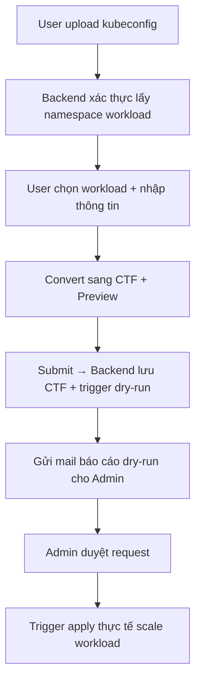

# 📄 URD: Tự động Scale Workload K8s Ngoài Giờ Hành Chính

## 1. 🎯 Mục tiêu & Use Case
- Tự động scale các workload Kubernetes ngoài giờ hành chính để giảm chi phí tài nguyên.
- Một số workload sẽ được khai báo **ngoại lệ (exception)** theo thời gian hoạt động linh hoạt hơn.
- Workload mặc định gồm 2 loại: `deployment`, `statefulset`.
- Quy trình sẽ được thực thi đầu và cuối giờ làm việc qua tool định kỳ hoặc Web UI trigger tay.
- Các workload không có rule khai báo sẽ mặc định:
  - Scale **về 0 ngoài giờ**.
  - Trong giờ hành chính **scale mặc định về 1 replica**, hoặc replica được khai báo sẵn qua Helm values.

## 2. 🔧 Công nghệ & công cụ
- Ngôn ngữ: `Python` (FastAPI cho backend), `React` + `Tailwind` (frontend).
- Triển khai bằng Helm Chart trên Kubernetes.
- Hỗ trợ trigger định kỳ bằng: `K8s CronJob`, `Jenkins`, `AWX`, `Ansible`.

## 3. 🧾 Định dạng khai báo CTF (Compact Table Format)

```text
# requester | namespace | workload | replica | days     | hours   | expire     | purpose
quyen.nt    | team1     | t1-A     | 2       | Mon-Sat  | 8h-22h  | 15/08/2025 | test service A
```

### Mô tả trường CTF
| Field       | Bắt buộc | Mô tả |
|-------------|----------|-------|
| requester   | ✅       | Người tạo request (tự lấy từ kubeconfig) |
| namespace   | ✅       | Namespace workload (tự detect từ kubeconfig) |
| workload    | ✅       | Tên workload (tự detect từ kubeconfig) |
| replica     | ⬆️       | Số lượng replica muốn bật (mặc định = 1, người dùng có thể chỉnh) |
| days        | ✅       | VD: Mon-Fri, Sat-Sun |
| hours       | ✅       | VD: 08h-18h |
| expire      | ✅       | DD/MM/YYYY – Ngày hết hạn rule |
| purpose     | ✅       | Mục đích bật workload |

## 4. ⚙️ Web UI – Tạo & duyệt exception list

### 4.1. Giao diện người dùng
- Upload file kubeconfig để xác thực và truy xuất thông tin user.
- Tự động detect namespace và workload theo kubeconfig.
- Hiển thị danh sách workload có thể thao tác → chọn workload cần bật.
- Nhập:
  - Purpose (bắt buộc)
  - Replica (mặc định 1, có thể chỉnh)
  - Thời gian hoạt động: chọn ngày (`days`), giờ (`hours`)
  - Expire (bắt buộc)

### 4.2. Giao diện quản trị
- Xem danh sách request đang chờ duyệt (từ người dùng).
- Xem trước bản dry-run report (preview trạng thái bật/tắt workload).
- Approve để lưu lại rule vào hệ thống & áp dụng thực tế.

## 5. 🔄 Flow xử lý hệ thống



## 6. 🧠 Logic xử lý backend

### 6.1. Khi scale tự động:
- Nếu workload nằm trong CTF → lấy replica, days, hours để xác định trạng thái bật/tắt.
- Nếu không nằm trong CTF:
  - Trong giờ hành chính: scale về default replica (1 hoặc giá trị cấu hình qua Helm).
  - Ngoài giờ hành chính: scale về 0.

### 6.2. Ưu tiên rule:
- Nếu một workload có nhiều rule:
  - Ưu tiên rule có `expire` xa hơn.
  - Nếu cùng `expire`, ưu tiên rule có khoảng thời gian dài hơn.

### 6.3. Lock file:
- Đảm bảo chỉ có 1 phiên bản tool chạy cùng lúc (tránh race condition).
- VD: `/tmp/k8s-autoscale.lock`

## 7. ✉️ Gửi mail & Audit Trail

### 7.1. Gửi mail
- Khi có thay đổi scale thực tế → gửi báo cáo chi tiết cho admin.
- Khi có user tạo request mới → gửi mail dry-run preview cho admin.

### 7.2. Audit
- Lưu file `.ctf` dưới version (kèm timestamp hoặc hash).
- Dùng để audit các rule trước đó đã duyệt.

## 8. 🧪 Dry-run & Logging
- Dry-run cho phép mô phỏng scale, không thay đổi thật.
- Logging sẽ tận dụng log hệ thống (cronjob, Jenkins, Ansible...).
- Tùy chọn:
  - `--dry-run`: in trạng thái xử lý, không scale thật
  - `--verbose`: ghi log chi tiết cho debug

## 9. 📅 Cron Schedule gợi ý
- 07:00: scale các workload theo rule hoặc mặc định (1 hoặc giá trị khai báo)
- 18:30: scale về 0 nếu không có rule

## 10. 🗄️ Lưu trữ cấu hình

### 10.1. Rule exception từ UI
- Sau khi admin duyệt → hệ thống lưu rule exception thành file `.ctf` (backend quản lý).
- Lưu trữ file `.ctf` tại PVC (volume) hoặc thư mục nội bộ.

### 10.2. Default replica cho workload
- Các workload có thể có replica mặc định khác 1 (VD: 2, 3,...)
- Khai báo qua `values.yaml` của Helm:

```yaml
defaultReplicas:
  team1/t1-A: 2
  team1/t2-B: 3
```

## 11. 🚀 Deploy bằng Helm

### 11.1. Cài đặt nhanh

```bash
helm repo add autoscale https://your-repo/autoscale
helm install autoscale-system autoscale/autoscale-system -f values.yaml
```

### 11.2. Thành phần hệ thống
| Thành phần        | Mô tả |
|-------------------|------|
| Backend API       | FastAPI xử lý auth, convert CTF, trigger scale |
| Frontend Web UI   | React form upload kubeconfig & tạo rule |
| Cronjob K8s       | Trigger scale định kỳ |
| Mail Notifier     | Gửi báo cáo dry-run & báo cáo thật |
| Volume            | PVC lưu file `.ctf` & log |
| Config            | `values.yaml` gồm SMTP, thời gian, default replica |

## ✅ Tổng kết
- Toàn bộ logic scale được kiểm soát chặt chẽ bằng UI và rule.
- Quy trình phê duyệt minh bạch, có audit.
- Dễ triển khai, tích hợp vào hệ thống K8s hiện tại.
- Mở rộng được cho các team với workload riêng biệt.


## 13. 📁 Cấu trúc project Backend
```bash
k8s-autoscaler/
│
├── autoscaler/                    # Thư mục code chính
│   ├── __init__.py
│   ├── ctf_parser.py              # Parse và validate file .ctf
│   ├── kubeconfig_parser.py       # Parse file kubeconfig, lấy user, namespace
│   ├── workload_query.py          # Query workload theo namespace & quyền
│   ├── dry_run_engine.py          # Xử lý dry-run logic, detect diff
│   ├── scale_executor.py          # Gửi scale command thực tế qua kube API
│   ├── mail_notifier.py           # Gửi mail dry-run & approved report
│   ├── scheduler.py               # Hàm lên lịch bật/tắt workload
│   ├── config.py                  # Load & quản lý config global
│   └── utils.py                   # Hàm phụ trợ chung
│
├── api/                           # Backend FastAPI (REST API)
│   ├── __init__.py
│   ├── main.py                    # Khởi tạo FastAPI app
│   ├── routes/                    # Route group
│   │   ├── __init__.py
│   │   ├── workload.py            # API: upload kubeconfig, get workloads
│   │   ├── rule.py                # API: submit rule, preview, approve
│   │   └── health.py              # API: health check
│
├── frontend/                      # Frontend React app (nằm ngoài Python)
│   └── (separately managed - repo/link)
│
├── cronjob/                       # Lệnh thực thi qua CronJob
│   └── run_schedule.py           # Script chính cho sáng/tối
│
├── tests/                         # Unit test
│   ├── test_ctf_parser.py
│   ├── test_dry_run.py
│   └── ...
│
├── conf/                          # File cấu hình mẫu
│   ├── values.example.yaml        # Mẫu config Helm values.yaml
│   └── example.ctf                # Mẫu rule đầu vào
│
├── Dockerfile
├── helm/                          # Helm Chart
│   └── autoscaler/...
├── requirements.txt
├── README.md
└── urd_autoscale.md               # 📄 Tài liệu URD chính thức (file này)
```
